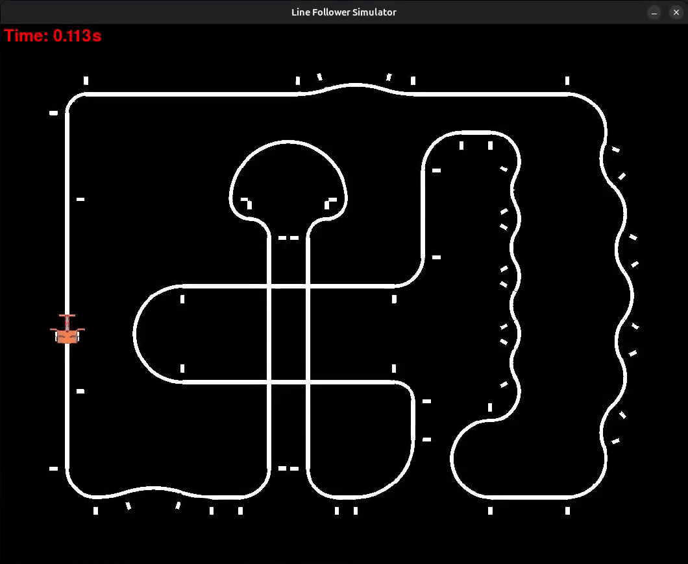
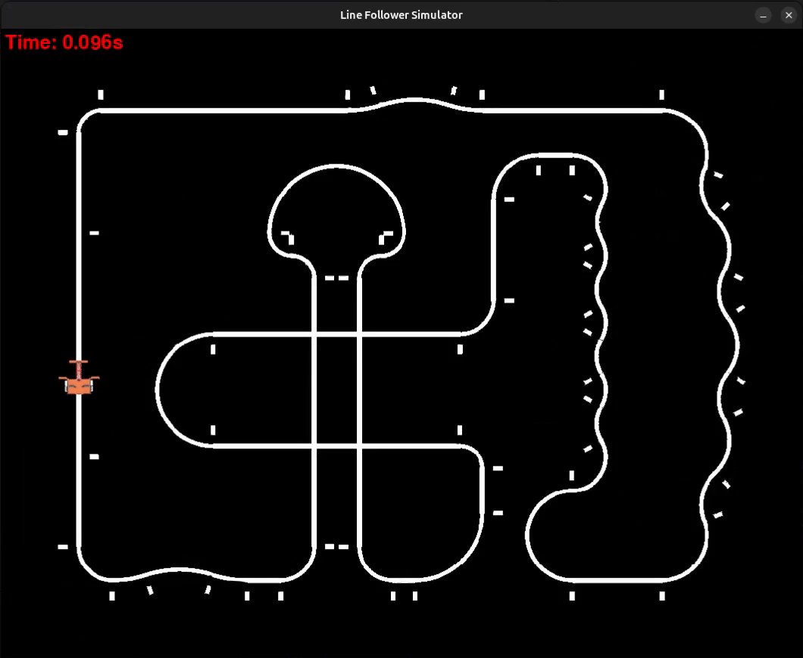
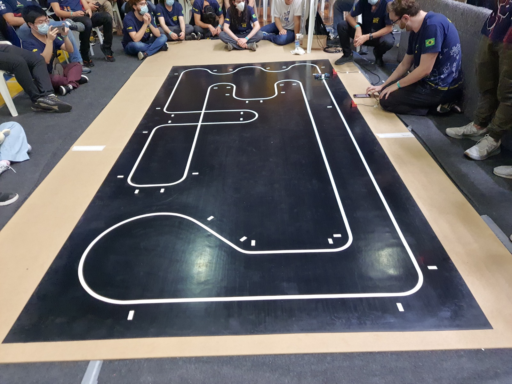
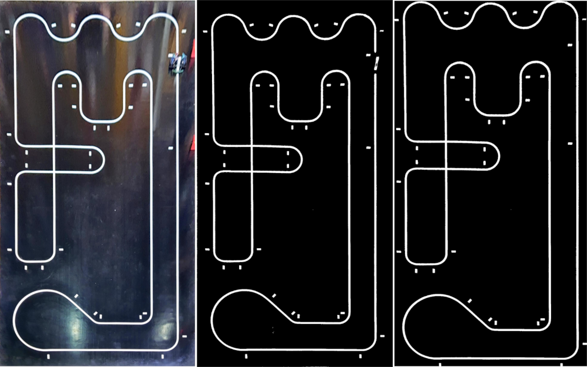

# 🤖 Line follower simulator

## Introduction

The **Line Follower Simulator** is a Python-based simulation environment designed to emulate the behavior of a line-following robot. This project allows users to test and develop various robot control algorithms. The simulator includes a physics model for the robot's dynamics.



## 🛠️ Requisites
Install python3, and then the dependencies in a venv environment. In the root of this project:

```bash
$ python3 -m venv .venv
$ source .venv/bin/activate
$ pip install pygame
$ pip install numpy
$ pip install matplotlib
$ pip install opencv-python
```

## ▶️ Usage
The main file for the simulator is `simulator.py`. In this file, you can configure the following:

- **Robot Logic**: Select the desired robot control logic by uncommenting the appropriate line in the SELECTED_LOGIC section.

- **Map**: Choose the map configuration by setting the map_selected variable to a map defined on `maps_configs.py`

After that just run the simulator on the venv environment:

```
python3 simulator.py
```

## 💻 Robot Control Logic
All the possible implementations for the robot logic reside in the `robot_programs` folder. The simulator is responsible for rendering the screen and providing the environment for the program to run, but the actual logic of the program is in this folder.

The user can create custom programs in this folder and then import them into the `simulator.py` file for testing an algorithm. The project already has 6 pre-defined programs that can be used as a reference for how to create a new program.

All programs use the "RobotLogic Interface" that is defined in `base_logic.py`.

To select which logic will be used, go to the `simulator.py`file and uncomment the desired logic implementation under `# 1. SELECT THE ROBOT BRAIN ---`

The predefined logic programs are explained in the following topics:


### Manual control:
The `ManualLogic` is a program to test the robot's movements using the keyboard arrows. Press the <up, down, left, right> keys to move the robot.


### Bit-bang logic:
The `BitBangLogic` is a program the will only use 2 line sensors to try to follow the line


### PID-based control:
The `PIDLogic` will use a PID controller to follow the line. It has 3 main parameters that you can change directly in the `pid_logic.py` file:
- Kp: The proportional Constant
- Kd: The derivative Constant
- Ki: The integral Constant
- Base speed (a number from 0 to 100) indicating the base PWM that will be sent to the motors

The robot will only stop after min_left_marker_counter are detected. This number is depedent on the map that is beeing used


### Map tracking logic:
The `MapTrackLogic` is almost identical to the PID Logic program, with the difference that every 5cm it saves the robot's position and the map curvature into a file. You can change the file to be saved by changing the `MAPPING_NAME` variable.

The maps are saved in `maps/mapping_data/MAPPING_NAME`. Three maps are saved:

Map Data: The exact coordinates measured

Radius Map: The curvature of the track, measured between every two points

Shortcut Map: Calculated on top of Map Data, it makes a moving average of the map to generate shortcuts

You can also change `TRACK_POINTS_DIST_CM` to set the distance between each point to be saved.

They can then be read and used by the `OptimizedRunLogic` and the `PurePursuitLogic` programs.

It is possible to visualize what was mapped using the script `python3 maps/draw_mapped_file.py`. Just edit the input and output before running, and a .png image will be generated with the mapped path.

An example map is located in `maps/mapping_data/map_example`.


### Optimized run logic:
The `OptimizedRunLogic` is almost the same as the PID Logic program, with the difference that it reads a mapping file that was mapped with `MapTrackLogic` and saved in `maps/mapping_data/MAPPING_NAME` and uses this file to calculate the base speed at each point of the map. So it will try to accelerate on straight lines and maintain a smaller speed in curves.

Change the path in the `MAP_LIST` variable to point to the map you want to read for the current map being used.

You can also configure the PID constants and the speed that you want in each curvature in the `radius_to_velocity` function.



### Pure pursuit logic:
The `PurePursuitLogic` uses the pure pursuit algorithm to follow a list of points. In this mode, it will read a mapping file defined in the `MAP_FILE` variable and follow these points. It will not use line sensors and will make a pure virtual line following.

The main parameters to change are the `look_ahead` distance (the greater it is, the smoother it will follow) and `max_waypoints_ahead`, which defines how many points ahead of the current point it will search for the next point.

You can use the shortcut map or the normal map here. The shortcut map will try to skip some curves.


## 🎛️ Extra configs
The simulator also has some configurations that can be changed in the `motor.py` file and in the `robot.py` file.

You can change, for example, the robot's battery voltage usage, and kv, kt, and other parameters of the motor, and the mass and normal force generated by the robot.

Explore those files to see every configuration that it is possible to change.

## 🧾 Maps
Maps are selected by editing the variable `map_selected` in the `simulator.py` file. For it to be a possible map, it should be defined in the file `map_configs.py`.

In addition to the .png image of the map, we need to define:

- MAP_FILE_NAME: Name of the .png image that will be used as a map and is inside `maps`folder
- MAP_WIDTH_CM: The real life width of the map in centimeters
- MAP_HEIGHT_CM: The real life height of the map in centimeters
- MAP_MARGIN_CM: A Margin in centimeters for better visualization
- MAP_CM_PER_PIXELS: How many centimeters will be represented for every pixel (usually 2 or 3)
- ROBOT_INIT_POS_X_CM: The position x in centimeters that the robot will start
- ROBOT_INIT_POS_Y_CM: The position y in centimeters that the robot will start
- ROBOT_INIT_ANGLE: The angle in degrees that the robot will start
- MIN_LEFT_MARKER_COUNTER: The minimal number of left markers that the robot should count in order to stop when seeing a right marker

There are currently a lot of map images defined on `maps` folder, but only some of them have the complete definition on the `maps_configs.py` file.

When defining a new map, if you don't know the real-life dimensions in centimeters, you can estimate the height and width of the map using as a reference that the side markers are always 4cm x 2cm. So count the pixels used for a marker and make the proportion for the whole image based on how many pixels the image has.

For the robot's initial position on the map, I think the easiest method is to use `ManualLogic` and by trial and error, change the coordinates until the robot starts in the desired position.

### 📷 Maps from images
We have a script in `image_conversion/map_from_img`that converts photos of a map into a map we can use on the simulator. The simulator requires the map to be completely black and white, so this script has a `FILTER_THERESHOLD` that converts every pixel to pure black or pure white depending on if it is above or below the threshold.

To convert a photo into a map, follow these steps:

1. Take a picture of the map;
2. Crop and align img using office lens app on your smartphone;
3. Adjust parameters in `map_from_img.py`, such as input file, output file, and threshold
4. Run `map_from_img.py` to convert image to black and white
5. Use GIMP (or any other image editor) to adjust small errors in generated image
6. Crop the image to include only the map (Image >> Crop to content in GIMP)
7. Estimate the height and width of the map in the real life in centimeters. For this you can use as reference that the side markers are always 4cm x 2cm . Count the pixels used for a marker and make the proportion for the whole image.
8. Define the map scale and where the robot will start
9. Populate map_configs.py with all this data

An example of how map2.png was generated:

- Step 1



- Steps 2, 4 and 5 from left to right

